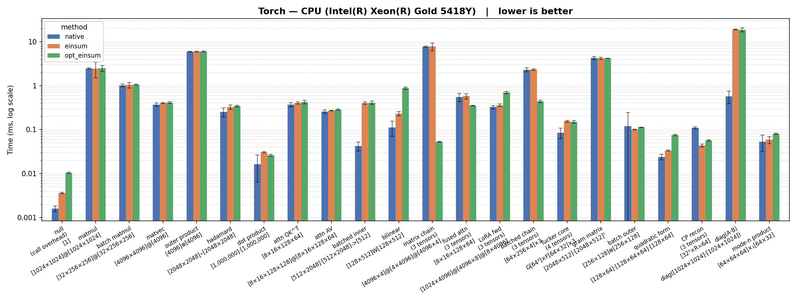
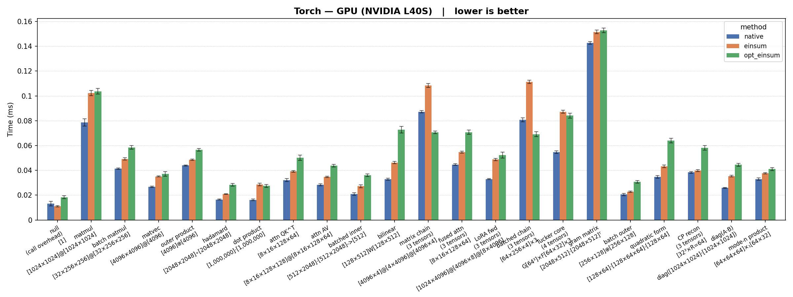
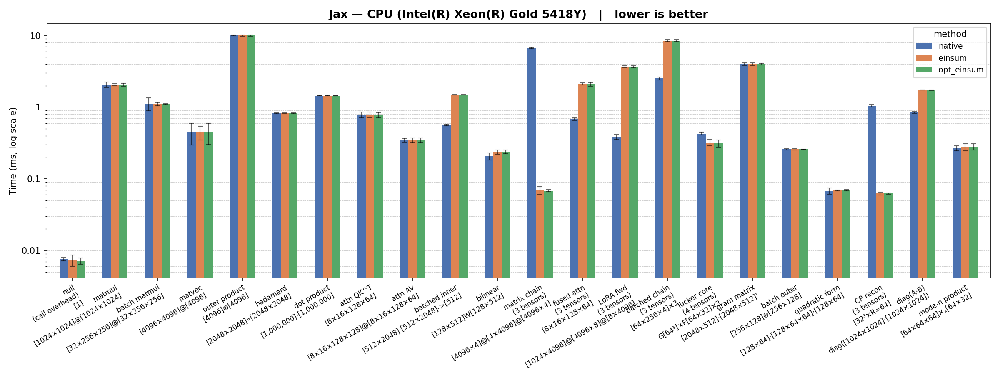
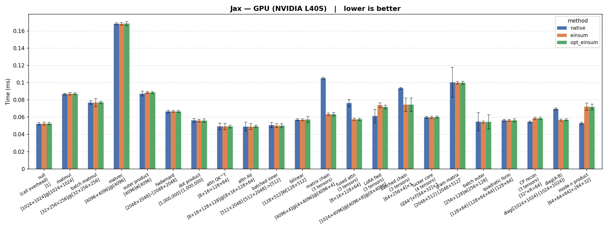

# Study: einsum vs native vs opt_einsum

Benchmarks 22 common ML linear algebra operations across JAX and PyTorch,
comparing native functions, `einsum`, and `opt_einsum` on CPU and GPU.
A null baseline op measures raw kernel launch overhead so GPU savings can
be interpreted relative to that floor.

## Running

```bash
uv sync
uv run python benchmark.py
```

### Options

| Flag | Default | Description |
|------|---------|-------------|
| `--device` | all available | Comma-separated: `cuda`, `cpu`, or `cuda,cpu` |
| `--framework` | `jax,pytorch` | Comma-separated: `jax`, `pytorch`, or `jax,pytorch` |
| `-n` / `--iterations` | 128 | Timed iterations per measurement |
| `-w` / `--warmup` | 16 | Warmup iterations before timing |
| `--cooldown` | 0.1 | Seconds to sleep between iterations |

## Summary

There's no disadvantage to using einsum notation in Jax. Performance is typically equal, and sometimes better. The built in `einsum` compiler appears to find the same optimizations as `opt_einsum`.

On PyTorch, the built-in kernels typically outperform einsum and barely lose to einsum when they do.

Not every expression benifits form einsum contraction. At least three dimentions need to exist in the expression for the possibility of a more optimal contraction to exist.

### Kernel launch floor

The null overhead op (relu on a size-1 tensor) shows the measurement floor: **~0.013–0.018 ms
for PyTorch GPU** and **~0.052 ms for JAX GPU**.

JAX's GPU dispatch baseline is 3–4× higher than PyTorch's. Any GPU savings smaller than this floor are invisible in the results. On CPU the floor is sub-microsecond for native dispatch (~0.002 ms) but rises to ~0.011 ms for `opt_einsum` even for trivial operations.


## Results

### PyTorch — CPU

```
torch/cpu
Operation           | Shape                           |     native      |     einsum      |   opt_einsum
-----------------------------------------------------------------------------------------------------------
null                | [1]                             | 0.0016[0.0002]  | 0.0036[0.0001]  | 0.0104[0.0003]
matmul              | [1024×1024]@[1024×1024]         | 2.4359[0.0889]  | 2.4601[0.9645]  | 2.4906[0.3854]
batch matmul        | [32×256×256]@[32×256×256]       | 1.0160[0.0764]  | 1.0388[0.1518]  | 1.0544[0.0242]
matvec              | [4096×4096]@[4096]              | 0.3702[0.0317]  | 0.4007[0.0064]  | 0.4131[0.0158]
outer product       | [4096]⊗[4096]                   | 5.9256[0.1177]  | 5.9332[0.1360]  | 5.9698[0.1236]
hadamard            | [2048×2048]∘[2048×2048]         | 0.2514[0.0575]  | 0.3289[0.0371]  | 0.3442[0.0156]
dot product         | [1,000,000]·[1,000,000]         | 0.0164[0.0100]  | 0.0306[0.0008]  | 0.0259[0.0014]
attention QK^T      | [8×16×128×64]                   | 0.3691[0.0422]  | 0.4036[0.0219]  | 0.4228[0.0388]
attention AV        | [8×16×128×128]@[8×16×128×64]    | 0.2571[0.0235]  | 0.2705[0.0054]  | 0.2862[0.0087]
batched inner       | [512×2048]·[512×2048]->[512]    | 0.0424[0.0095]  | 0.4001[0.0246]  | 0.4092[0.0353]
bilinear            | [128×512]W[128×512]             | 0.1126[0.0426]  | 0.2321[0.0258]  | 0.8769[0.0530]
matrix chain        | [4096×4]@[4×4096]@[4096×4]      | 7.7392[0.2718]  | 7.8034[1.5024]  | 0.0531[0.0010]
fused attn          | [8×16×128×64]                   | 0.5523[0.1169]  | 0.5768[0.0815]  | 0.3499[0.0070]
LoRA forward        | [1024×4096]@[4096×8]@[8×4096]   | 0.3253[0.0286]  | 0.3551[0.0249]  | 0.6983[0.0458]
batched chain       | [64×256×4]×3                    | 2.2851[0.2430]  | 2.3207[0.0852]  | 0.4378[0.0261]
Tucker core         | G[64³]×F[64×32]×3               | 0.0845[0.0231]  | 0.1547[0.0068]  | 0.1512[0.0101]
gram matrix         | [2048×512]·[2048×512]ᵀ          | 4.2629[0.3180]  | 4.2088[0.2207]  | 4.1938[0.0310]
batch outer         | [256×128]⊗[256×128]             | 0.1196[0.1238]  | 0.1010[0.0014]  | 0.1129[0.0015]
quadratic form      | [128×64]·[128×64×64]·[128×64]   | 0.0240[0.0036]  | 0.0333[0.0010]  | 0.0753[0.0025]
CP reconstruction   | [32³×R=64]                      | 0.1100[0.0057]  | 0.0436[0.0032]  | 0.0570[0.0019]
diag matmul         | diag([1024×1024]·[1024×1024])   | 0.5694[0.1802]  | 18.9483[0.3324] | 18.8017[1.9817]
mode-n product      | [64×64×64]×₁[64×32]             | 0.0528[0.0216]  | 0.0584[0.0109]  | 0.0802[0.0033]
-----------------------------------------------------------------------------------------------------------
```



### PyTorch — CUDA

```
torch/cuda
Operation           | Shape                           |     native      |     einsum      |   opt_einsum
-----------------------------------------------------------------------------------------------------------
null                | [1]                             | 0.0133[0.0018]  | 0.0110[0.0005]  | 0.0184[0.0011]
matmul              | [1024×1024]@[1024×1024]         | 0.0785[0.0029]  | 0.1022[0.0020]  | 0.1037[0.0023]
batch matmul        | [32×256×256]@[32×256×256]       | 0.0414[0.0006]  | 0.0492[0.0009]  | 0.0584[0.0015]
matvec              | [4096×4096]@[4096]              | 0.0268[0.0005]  | 0.0351[0.0004]  | 0.0372[0.0019]
outer product       | [4096]⊗[4096]                   | 0.0440[0.0004]  | 0.0486[0.0005]  | 0.0565[0.0010]
hadamard            | [2048×2048]∘[2048×2048]         | 0.0164[0.0004]  | 0.0209[0.0004]  | 0.0283[0.0011]
dot product         | [1,000,000]·[1,000,000]         | 0.0162[0.0006]  | 0.0287[0.0011]  | 0.0275[0.0012]
attention QK^T      | [8×16×128×64]                   | 0.0322[0.0011]  | 0.0391[0.0007]  | 0.0501[0.0021]
attention AV        | [8×16×128×128]@[8×16×128×64]    | 0.0283[0.0007]  | 0.0348[0.0005]  | 0.0439[0.0011]
batched inner       | [512×2048]·[512×2048]->[512]    | 0.0209[0.0010]  | 0.0272[0.0012]  | 0.0360[0.0011]
bilinear            | [128×512]W[128×512]             | 0.0329[0.0007]  | 0.0462[0.0009]  | 0.0727[0.0027]
matrix chain        | [4096×4]@[4×4096]@[4096×4]      | 0.0872[0.0010]  | 0.1084[0.0015]  | 0.0706[0.0010]
fused attn          | [8×16×128×64]                   | 0.0446[0.0007]  | 0.0547[0.0008]  | 0.0707[0.0018]
LoRA forward        | [1024×4096]@[4096×8]@[8×4096]   | 0.0330[0.0003]  | 0.0487[0.0009]  | 0.0523[0.0025]
batched chain       | [64×256×4]×3                    | 0.0808[0.0016]  | 0.1113[0.0013]  | 0.0691[0.0020]
Tucker core         | G[64³]×F[64×32]×3               | 0.0547[0.0010]  | 0.0871[0.0012]  | 0.0841[0.0021]
gram matrix         | [2048×512]·[2048×512]ᵀ          | 0.1427[0.0011]  | 0.1516[0.0014]  | 0.1528[0.0018]
batch outer         | [256×128]⊗[256×128]             | 0.0205[0.0008]  | 0.0228[0.0005]  | 0.0307[0.0010]
quadratic form      | [128×64]·[128×64×64]·[128×64]   | 0.0348[0.0011]  | 0.0433[0.0011]  | 0.0641[0.0018]
CP reconstruction   | [32³×R=64]                      | 0.0384[0.0006]  | 0.0397[0.0008]  | 0.0581[0.0019]
diag matmul         | diag([1024×1024]·[1024×1024])   | 0.0258[0.0003]  | 0.0353[0.0006]  | 0.0445[0.0012]
mode-n product      | [64×64×64]×₁[64×32]             | 0.0329[0.0010]  | 0.0376[0.0006]  | 0.0410[0.0012]
-----------------------------------------------------------------------------------------------------------
```



### JAX — CPU

```
jax/cpu
Operation           | Shape                           |     native      |     einsum      |   opt_einsum
-----------------------------------------------------------------------------------------------------------
null                | [1]                             | 0.0076[0.0004]  | 0.0073[0.0013]  | 0.0072[0.0007]
matmul              | [1024×1024]@[1024×1024]         | 2.0705[0.1806]  | 2.0613[0.0688]  | 2.0602[0.0893]
batch matmul        | [32×256×256]@[32×256×256]       | 1.1209[0.2288]  | 1.1101[0.0622]  | 1.1097[0.0143]
matvec              | [4096×4096]@[4096]              | 0.4486[0.1512]  | 0.4478[0.0966]  | 0.4513[0.1491]
outer product       | [4096]⊗[4096]                   | 10.0343[0.1343] | 10.0321[0.1750] | 10.0414[0.2093]
hadamard            | [2048×2048]∘[2048×2048]         | 0.8224[0.0140]  | 0.8245[0.0099]  | 0.8239[0.0102]
dot product         | [1,000,000]·[1,000,000]         | 1.4501[0.0056]  | 1.4500[0.0045]  | 1.4499[0.0040]
attention QK^T      | [8×16×128×64]                   | 0.7824[0.0704]  | 0.7880[0.0695]  | 0.7794[0.0702]
attention AV        | [8×16×128×128]@[8×16×128×64]    | 0.3488[0.0217]  | 0.3472[0.0262]  | 0.3462[0.0256]
batched inner       | [512×2048]·[512×2048]->[512]    | 0.5678[0.0167]  | 1.4941[0.0026]  | 1.4941[0.0026]
bilinear            | [128×512]W[128×512]             | 0.2077[0.0234]  | 0.2370[0.0171]  | 0.2389[0.0149]
matrix chain        | [4096×4]@[4×4096]@[4096×4]      | 6.7145[0.1643]  | 0.0690[0.0085]  | 0.0685[0.0024]
fused attn          | [8×16×128×64]                   | 0.6831[0.0309]  | 2.1171[0.0650]  | 2.0960[0.1203]
LoRA forward        | [1024×4096]@[4096×8]@[8×4096]   | 0.3836[0.0294]  | 3.6922[0.0850]  | 3.6551[0.1241]
batched chain       | [64×256×4]×3                    | 2.5321[0.1204]  | 8.5249[0.2627]  | 8.5248[0.2636]
Tucker core         | G[64³]×F[64×32]×3               | 0.4292[0.0193]  | 0.3214[0.0323]  | 0.3125[0.0350]
gram matrix         | [2048×512]·[2048×512]ᵀ          | 3.9925[0.1612]  | 3.9984[0.1466]  | 3.9950[0.1051]
batch outer         | [256×128]⊗[256×128]             | 0.2590[0.0062]  | 0.2590[0.0068]  | 0.2588[0.0017]
quadratic form      | [128×64]·[128×64×64]·[128×64]   | 0.0679[0.0067]  | 0.0692[0.0009]  | 0.0694[0.0014]
CP reconstruction   | [32³×R=64]                      | 1.0521[0.0449]  | 0.0626[0.0029]  | 0.0625[0.0012]
diag matmul         | diag([1024×1024]·[1024×1024])   | 0.8457[0.0235]  | 1.7377[0.0060]  | 1.7332[0.0054]
mode-n product      | [64×64×64]×₁[64×32]             | 0.2673[0.0222]  | 0.2765[0.0311]  | 0.2813[0.0298]
-----------------------------------------------------------------------------------------------------------
```



### JAX — CUDA

```
jax/cuda
Operation           | Shape                           |     native      |     einsum      |   opt_einsum
-----------------------------------------------------------------------------------------------------------
null                | [1]                             | 0.0522[0.0013]  | 0.0526[0.0017]  | 0.0524[0.0015]
matmul              | [1024×1024]@[1024×1024]         | 0.0868[0.0011]  | 0.0871[0.0014]  | 0.0872[0.0010]
batch matmul        | [32×256×256]@[32×256×256]       | 0.0769[0.0021]  | 0.0768[0.0047]  | 0.0770[0.0012]
matvec              | [4096×4096]@[4096]              | 0.1681[0.0012]  | 0.1682[0.0015]  | 0.1685[0.0023]
outer product       | [4096]⊗[4096]                   | 0.0872[0.0028]  | 0.0885[0.0012]  | 0.0885[0.0009]
hadamard            | [2048×2048]∘[2048×2048]         | 0.0666[0.0014]  | 0.0666[0.0010]  | 0.0665[0.0012]
dot product         | [1,000,000]·[1,000,000]         | 0.0562[0.0022]  | 0.0559[0.0016]  | 0.0560[0.0019]
attention QK^T      | [8×16×128×64]                   | 0.0492[0.0039]  | 0.0492[0.0037]  | 0.0491[0.0017]
attention AV        | [8×16×128×128]@[8×16×128×64]    | 0.0490[0.0052]  | 0.0489[0.0034]  | 0.0492[0.0015]
batched inner       | [512×2048]·[512×2048]->[512]    | 0.0507[0.0029]  | 0.0501[0.0022]  | 0.0501[0.0023]
bilinear            | [128×512]W[128×512]             | 0.0570[0.0011]  | 0.0569[0.0010]  | 0.0571[0.0035]
matrix chain        | [4096×4]@[4×4096]@[4096×4]      | 0.1051[0.0011]  | 0.0634[0.0015]  | 0.0634[0.0021]
fused attn          | [8×16×128×64]                   | 0.0762[0.0041]  | 0.0575[0.0013]  | 0.0574[0.0012]
LoRA forward        | [1024×4096]@[4096×8]@[8×4096]   | 0.0611[0.0078]  | 0.0738[0.0027]  | 0.0718[0.0022]
batched chain       | [64×256×4]×3                    | 0.0935[0.0010]  | 0.0744[0.0078]  | 0.0744[0.0077]
Tucker core         | G[64³]×F[64×32]×3               | 0.0598[0.0011]  | 0.0597[0.0013]  | 0.0602[0.0011]
gram matrix         | [2048×512]·[2048×512]ᵀ          | 0.1003[0.0173]  | 0.0998[0.0015]  | 0.0998[0.0016]
batch outer         | [256×128]⊗[256×128]             | 0.0547[0.0104]  | 0.0543[0.0012]  | 0.0545[0.0083]
quadratic form      | [128×64]·[128×64×64]·[128×64]   | 0.0562[0.0013]  | 0.0562[0.0012]  | 0.0563[0.0017]
CP reconstruction   | [32³×R=64]                      | 0.0545[0.0010]  | 0.0585[0.0012]  | 0.0586[0.0014]
diag matmul         | diag([1024×1024]·[1024×1024])   | 0.0695[0.0011]  | 0.0566[0.0012]  | 0.0569[0.0011]
mode-n product      | [64×64×64]×₁[64×32]             | 0.0530[0.0013]  | 0.0720[0.0042]  | 0.0717[0.0034]
-----------------------------------------------------------------------------------------------------------
```


